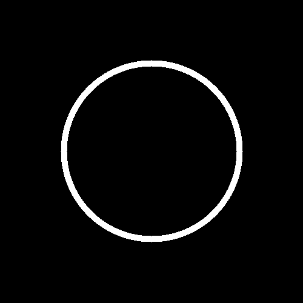
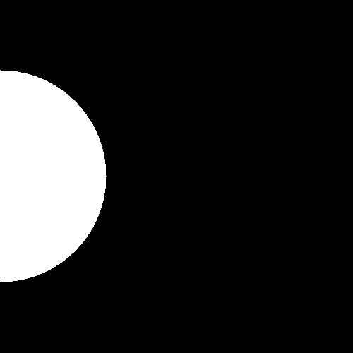
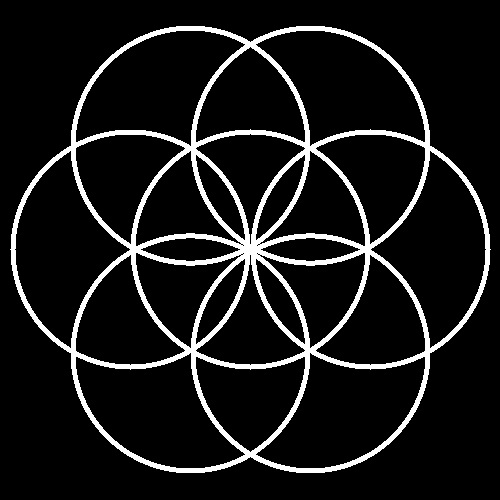
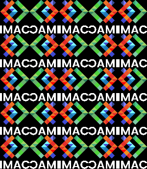
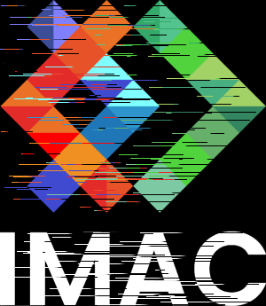
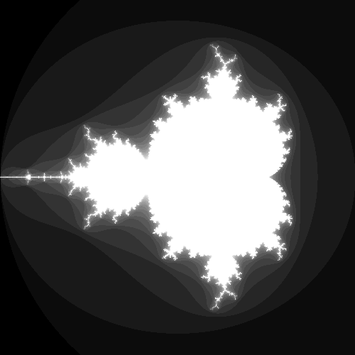
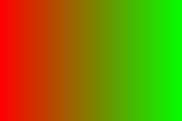
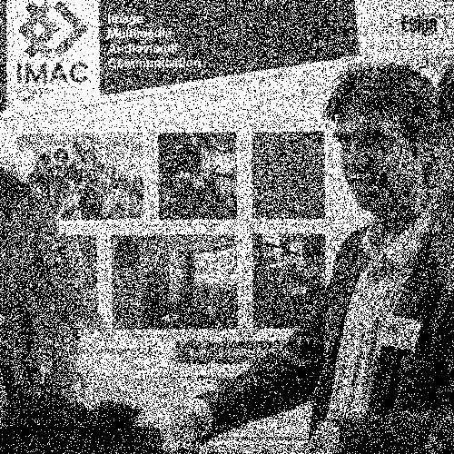
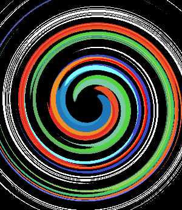

# S1 | Prog&Algo: Workshop

Workshop de ProgAlgo, IMAC2028 S1

Tous les exercices ont été réalisés sous forme de fonctions individuelles, puis la création des images a été faite dans le main, sous la forme suivante :

```
int main()
{
    {
        sil::Image image{"images/logo.png"}; // Lis l'image
        green(image); // Utilise la fonction pour modifier l'image
        image.save("output/green_imac.png"); // Sauvegarde l'image
    }
    {
        sil::Image image{"images/logo.png"};
        swapRedBlue(image);
        image.save("output/swaped_imac.png");
    }
}
```

Pour alléger le code, j'ai décidé de ne pas garder l'entièreté du main, une fois les images créées. Ainsi, j'ai laissé quelques exemples (ci-dessus), ainsi que le code pour l'animation du disque (car différent des autres).

RMQ : L'aspect mathématique des exercices m'a facilité la vie (vive la prépa) et j'ai pu avancé rapidement sur les rosaces et rotations !

# Images de référence


# Exercices réalisés
## Nuances de vert


## Inversion de couleur (bleu <--> rouge)


## Noir et blanc


## Négatif


## Dégradé de noir et blanc
Le pourcentage de noir varie en fonction de la coordonnée x.


## Mirroir


## Bruit aléatoire
L'aléatoire est utilisé pour la position (x, y) des pixels et pour leur couleur (aléatoire pour chaque composante).


## Rotation 90°
Pour chaque pixel, on remplace ses coordonnées par ses nouvelles :
```
x' = image.height() - 1 - y
y' = x
```


## RGB Split
Utilisation de l'indice : pour chaque pixel, on prend un peu du rouge et du vert des pixels voisins.


## Différentes luminosités


## Disque, cercle, rosace



Pour l'animation, une boucle a été réalisée dans le main pour générer les images successives. Pour faciliter cette animation, des paramètres ont été ajoutés dans la fonction disk (et circle d'ailleurs pour faciliter la rosace).




## Mosaïques
J'ai laissé une fonction différente par étape de mosaïques afin de laisser mon chemin de pensée (d'abord trouver comment réaliser la mosaïque, puis retourner une image sur 2 puis une ligne sur 2)





## Glitch


## Tri de pixels
Le tri a été fait à l'aide du code Processing présenté dans la vidéo YouTube. On génère aléatoire la position et la taille d'une ligne de pixels, puis on la tri par luminosité de pixels.



## Fractale
Cette fractale avait été réalisée, de mon côté, dans le workshop d'Anthony. J'ai donc repris mon code Processing et je l'ai adapté.



## Dégradé de couleur



## Tramage



Ordered dithering avec matrice de Bayer 4x4 :
Principe du code : au lieu de se limiter à tester la luminosité d'un pixel par rapport à 0.5, on lui ajoute un facteur dépendant de sa position et de la matrice de Bayer, puis on compare cette luminosité par rapport à 0.5 (principe de base).


## Normalisation d'histogramme
Au début, j'avais la logique suivante :
```
void normalisation(sil::Image& image)
{
    ...
    // Pour chaque pixel, on adapte la luminosité en fonction des extrêmes
    for (glm::vec3& pix : image.pixels())
    {
        float b = (pix.r + pix.g + pix.b) / 3.f; // Brightness
        float newLum = (b - recordDark)/(recordLight - recordDark);

        pix = glm::vec3(newLum);
    }
}
```
Je normalisais donc la luminorisité de toutes les composantes en même temps (et non pas chaque composante individuellement) ce qui me donnait un rendu en gris. Après plusieurs essais, j'ai donc séparé les composantes.


## Vortex


## Convolution
Principe de l'algo général (vidéo) :
Pour chaque pixel :
- on centre le kernel sur le pixel
- on additionne les couleurs voisines pondérées par la valeur du kernel sur ce pixel
- on applique le résultat au pixel

Le plus compliqué était de trouver les formules de pixelX et pixelY car il fallait parcourir un vecteur de vecteur donc trouver les indices a été long.


### Blur naïf

### Blur séparé
Le principe est de passer deux kernels 1D l'un après l'autre, un kernel horizontal puis un kernel vertical.


J'ai ainsi créé deux fonctions qui utilisent les kernels 1D, horizontalement puis verticalement.